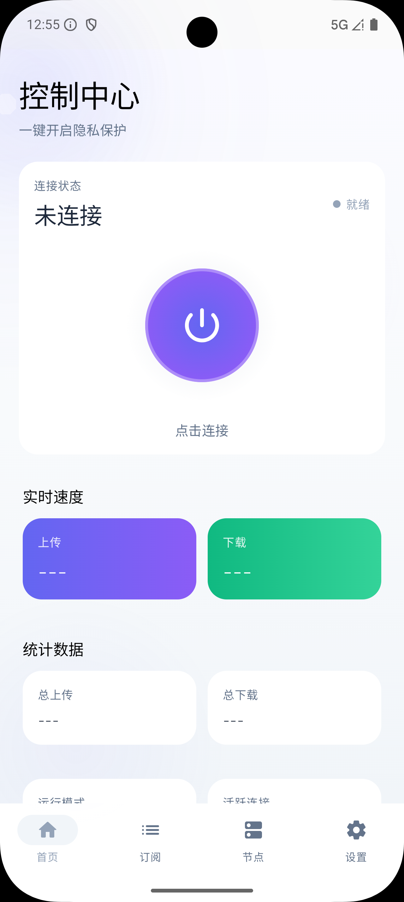

# Sing Box Windows Android

<div align="center">
  
  
  
  
  <a href="https://github.com/xinggaoya/sing-box-windows-android/actions/workflows/release.yml">
    
  </a>
</div>

**Language / 语言**: [English](README.md) | [中文](README.zh-CN.md)

---

<div align="center">
  
</div>

## 🎯 Introduction

Sing Box Windows Android is a modern Android VPN client application based on the sing-box core, providing simple and efficient network proxy management features. It supports multiple proxy protocols and features an elegant user interface with powerful functionality.

## ✨ Key Features

- 🚀 **High-Performance VPN Service**: Based on sing-box core for stable and reliable connections
- 📱 **Modern Interface**: Material 3 design built with Jetpack Compose
- 🔗 **Smart Subscription Management**: Add, edit, and manage multiple subscription links
- ⚡ **Real-time Node Testing**: Automatically test node latency for optimal connection selection
- 📊 **Traffic Monitoring**: Real-time display of network connection and traffic usage
- 🎯 **Automatic Node Grouping**: Smart organization and management of node groups
- 🔧 **Multi-Architecture Support**: Supports ARM64 and ARMv7 architecture devices
- 🌐 **Protocol Compatibility**: Full support for VLESS, Shadowsocks, and other mainstream proxy protocols

## 📱 Download & Install

### Latest Version

- [📥 v1.1.0 Stable Release](https://github.com/xinggaoya/sing-box-windows-android/releases/tag/v1.1.0)

### Architecture Selection

Choose the appropriate APK based on your device architecture:

| Architecture | Filename                      | Compatible Devices                       | Recommendation |
| ------------ | ----------------------------- | ---------------------------------------- | -------------- |
| arm64-v8a    | `app-arm64-v8a-release.apk`   | 64-bit ARM devices (most modern devices) | ⭐⭐⭐         |
| armeabi-v7a  | `app-armeabi-v7a-release.apk` | 32-bit ARM devices (older devices)       | ⭐⭐           |

### System Requirements

- **Android Version**: Android 10 (API 29) or higher
- **Storage Space**: At least 100MB available space
- **Permissions**: VPN permissions and network access

## 🚀 Quick Start

1. **Download**: Get the appropriate APK from the [Releases](https://github.com/xinggaoya/sing-box-windows-android/releases) page
2. **Install**: Install the APK file on your Android device
3. **Grant Permissions**: Allow VPN and notification permissions
4. **Add Subscription**: Enter your subscription link or import local node list
5. **Connect**: Select a node and connect to the VPN

## 📖 User Guide

### Adding Subscriptions

1. Open the app and tap "Add Subscription"
2. Enter subscription name and URL
3. Click "Add" and wait for synchronization to complete
4. Select the subscription to enable

### Import Local Nodes

You can also import local node lists:
1. Tap "Import Local" in subscription management
2. Select or paste node list content
3. Save to use locally managed nodes

### Node Management

- **Auto Selection**: Use the "Auto Test" group for automatic optimal node selection
- **Manual Selection**: Manually select specific nodes within groups
- **Node Testing**: Click the test button to measure node latency

### Traffic Monitoring

- Real-time display of upload/download speeds
- Statistics of cumulative traffic usage
- Connection status monitoring

## 🛠️ Technical Specifications

| Item                    | Specification                |
| ----------------------- | ---------------------------- |
| **Language**            | Kotlin                       |
| **UI Framework**        | Jetpack Compose + Material 3 |
| **Core Library**        | libbox (sing-box)            |
| **Min SDK**             | API 29 (Android 10)          |
| **Target SDK**          | API 36 (Android 15)          |
| **Build Tool**          | Gradle with Kotlin DSL       |
| **Supported Protocols** | VLESS, Shadowsocks, etc.     |

## 🔧 Development & Build

### Requirements

- Android Studio Hedgehog or higher
- JDK 17 or higher
- Android SDK (API 29+)

### Build Steps

```bash
# Clone repository
git clone https://github.com/xinggaoya/sing-box-windows-android.git
cd singboxwindows

# Build Debug version
./gradlew assembleDebug

# Build Release version
./gradlew assembleRelease

# Install to device
./gradlew installDebug
```

### GitHub Automated APK Build

- Single workflow: `.github/workflows/release.yml`
  - Trigger: `push tag v*` (for example `v1.2.1`)
  - Behavior: update latest libbox AAR first, then build signed Release APKs and create GitHub Release automatically

Signing is intentionally hardcoded (no environment variables):

- Keystore file: `app/signing/release.jks`
- Signing params: `app/build.gradle` -> `android.signingConfigs.release`

### Auto Update libbox AAR

```bash
# Pull latest sing-box release and rebuild app/libs/libbox.aar
./scripts/update-libbox.sh

# Build a specific version
./scripts/update-libbox.sh --version v1.12.0
```

See `docs/LIBBOX_AUTOBUILD.md` for full options and CI workflow details.

### Project Structure

```
app/
├── src/main/
│   ├── java/cn/moncn/sing_box_windows/
│   │   ├── config/          # Configuration management
│   │   ├── core/            # Core functionality (Clash API, status, diagnostics)
│   │   ├── ui/              # User interface (screens, components, theme)
│   │   └── vpn/             # VPN service
│   ├── res/                 # Resource files
│   └── libs/                # Local dependencies (libbox.aar)
└── build.gradle             # Module build configuration
```

### Architecture Overview

The app now defaults to a **v2 UDF/MVI architecture** (legacy entry is kept in codebase only for transition):

- **MVI Base**: Unified `Intent / State / Effect` flow
- **Gateway Layer**: Runtime/Subscription/Nodes/Settings/Diagnostics capabilities are abstracted behind interfaces
- **V2 Navigation Shell**: Home, Subscription, Nodes, Settings, Diagnostics all run on v2 flow

Legacy implementation follows **Singleton Store + Compose Reactive UI** pattern:

- **Store Pattern**: Global state management using singleton objects with `mutableStateOf`
- **Repository Pattern**: Configuration and subscription data persistence
- **Manager Pattern**: Core functionality coordination (OutboundGroupManager, CoreStatusManager)

For detailed architecture documentation, see [CLAUDE.md](CLAUDE.md).

## 🤝 Contributing

Contributions are welcome! Please follow these steps:

1. Fork this repository
2. Create a feature branch (`git checkout -b feature/AmazingFeature`)
3. Commit your changes (`git commit -m 'Add some AmazingFeature'`)
4. Push to the branch (`git push origin feature/AmazingFeature`)
5. Open a Pull Request

### Code Style

- Follow Kotlin official coding standards
- Use 4-space indentation
- Functions and variables in camelCase
- Class names in PascalCase
- Add necessary comments

## 📝 Changelog

See [CHANGELOG.md](docs/CHANGELOG.md) for detailed version update records.

### Recent Highlights

**v1.1.0** (2025-12-23)
- Clash API deep integration for real-time traffic statistics
- Local node import support
- Redesigned navigation with bottom bar
- Enhanced settings with auto-save

## 🐛 Issue Reporting

If you encounter issues, please:

1. Check [Known Issues](#known-issues)
2. Search existing [Issues](https://github.com/xinggaoya/sing-box-windows-android/issues)
3. If the issue is not resolved, create a new Issue with:
   - Device model and Android version
   - App version
   - Detailed error description and reproduction steps

## ⚠️ Known Issues

- Some older devices may require manual notification permission granting
- Connection instability in certain network environments
- Long subscription sync timeout (being optimized)

## 📄 License

This project is licensed under the MIT License - see the [LICENSE](LICENSE) file for details.

## 🙏 Acknowledgments

- [sing-box](https://github.com/SagerNet/sing-box) - Powerful network proxy tool
- [Jetpack Compose](https://developer.android.com/jetpack/compose) - Modern UI toolkit
- [Material Design 3](https://m3.material.io/) - Design system

## ⚖️ Disclaimer

This application is for learning and research purposes only. Please comply with local laws and regulations. The developer is not responsible for any consequences arising from the use of this application.

---

<div align="center">
  <strong>If this project helps you, please give it a ⭐ Star!</strong>
</div>
